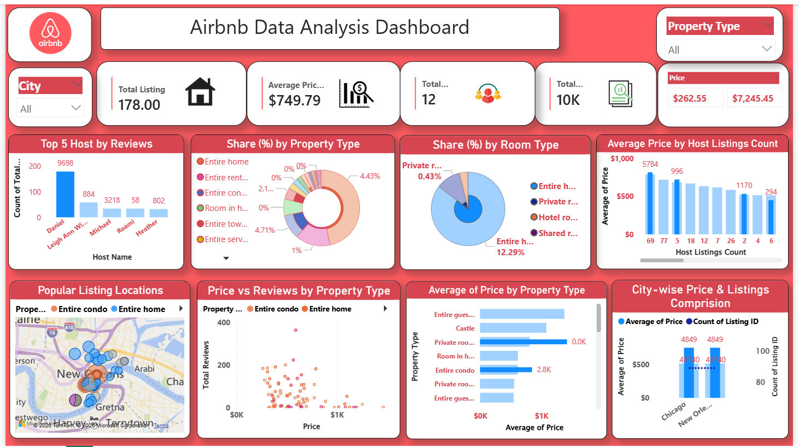

# Airbnb Market Analysis Dashboard

## Overview
An end-to-end data analytics project focused on analyzing Airbnb listing data to uncover pricing trends, host performance, property distribution, and location-based insights using **Python** and **Power BI**.

---

## Business Objective
The goal of this project was to answer key business questions:

- Identify popular Airbnb listing locations and their listing volume  
- Analyze pricing trends across different property types  
- Compare room/property type market share  
- Study relationship between pricing and reviews  
- Evaluate host performance and listing behavior  

---

## Tools & Technologies
- **Python**
- **Pandas**
- **Jupyter Notebook**
- **Power BI**
- **GitHub**

---

## Data Cleaning Process
Performed data preprocessing in Python:
- Removed duplicates  
- Handled missing values  
- Converted price into numeric format  
- Standardized data fields  
- Created pricing categories  
- Exported cleaned dataset to CSV  

---

## Dashboard Highlights

### KPI Metrics
- Total Listings  
- Average Price  
- Total Hosts  
- Total Reviews  

### Visual Analysis
- Popular Airbnb Locations  
- Top 5 Hosts by Reviews  
- Average Price by Host Listing Count  
- Average Price by Property Type  
- Price vs Reviews Analysis  
- Property Type Distribution  
- Room Type Distribution  

---

## Key Insights
- Entire home/apartment is the dominant room category  
- Premium property types show higher average prices  
- Moderate-priced listings attract more reviews  
- Few hosts dominate review performance  
- Listings are concentrated in major location clusters  

---

## Project Workflow
Raw Data → Python Cleaning → CSV Export → Power BI Dashboard → Insight Generation

## Author
**Mansi Srivastava**  
Aspiring Data Analyst | Power BI | Python | Data Visualization
